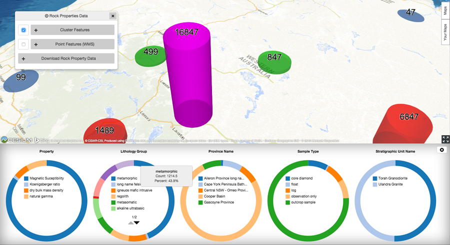

# explorer-rock-properties-components

AngularJS components related to rock properties, for use with Leaflet.<br/>
**This project is under development, and not ready for use.**

Potential functionality:

<ul>
	<li>Leverage data from rock properties Geoserver web service: http://www.ga.gov.au/geophysics-rockpropertypub-gws/web/</li>
	<li>Visualisation of data points, possibly clustering, or simple WMS imagery</li>
	<li>Filtering of rock properties data points</li>
	<li>Point or cluster inspector to reveal fine-grain data records, and/or high level charts/visualsation of aggregated data.</li>
	<li>Clip, zip, ship</li>
</ul>	

# Get started

```shell
$ npm install
$ bower install
$ tsd install
$ gulp
```


# Usage

`rocksPanelService.init(map, config)` is the entry point for the component.

It should be initialised with a JSON config object for service endpoints/params.

Example config:

```json
  {
	"useClusterPicking": true,
	"clusterServiceUrl": "resources/mock-service/explorer-cossap-services/service/rock-properties/clusters",
	"geoserverWmsUrl": "http://www.ga.gov.au/geophysics-rockpropertypub-gws/ga_rock_properties_wms/wms",
	"geoserverWmsVersion": "1.3.0",
	"geoserverWfsUrl": "http://www.ga.gov.au/geophysics-rockpropertypub-gws/ga_rock_properties_wfs/wfs/ows",
	"geoserverWmsLayerPrefix": "ga_rock_properties_wms:",
	"geoserverWfsVersion": "1.3.0",
	"geoserverWfsExportParams": {
	  "service": "wfs",
	  "version": "2.0.0",
	  "request": "GetFeature",
	  "count": 99999999,
	  "srsName": "epsg:4283"
	},
	"geoserverWfsExportFormats": ["csv", "application/json", "KML", "SHAPE-ZIP"],
	"geoserverWmsLegendParams": {
	  "REQUEST": "GetLegendGraphic",
	  "VERSION": "1.0.0",
	  "FORMAT": "image/png",
	  "WIDTH": 20,
	  "HEIGHT": 20,
	  "legend_options": "dpi:160;forcelabels:on;fontSize:7"
	},
	"rocksSummaryUrl": "http://ga.gov.au/explorer-web/service/rocks/summary",
    "rocksQueryUrl": "http://ga.gov.au/explorer-web/service/rocks/query",
    "rocksFeaturesUrl": "http://ga.gov.au/explorer-web/service/rocks/features",
	"geoserverDashboardUrl": "http://www.ga.gov.au/geophysics-rockpropertypub-gws/web/?wicket:bookmarkablePage=:org.geoserver.web.demo.MapPreviewPage",
	"filterNamesServiceUrl": "http://www.ga.gov.au/explorer-web/service/rockprops/filters"
  }
```

# Dependencies

This component uses:

<ul>
	<li><a href="http://leafletjs.com/">Leaflet JS</a></li>
	<li><a href="http://d3js.org/">D3.js</a></li>
	<li><a href="http://fortawesome.github.io/Font-Awesome/">Font Awesome icons</a></li>
	<li><a href="https://stuk.github.io/jszip/">JSZIP</a></li>
	<li><a href="https://github.com/Teleborder/FileSaver.js">FileSaver.js</a></li> 
</ul>

# Demo screenshots

<p>Chart clustered rock properties data:</p>



<p>Filter WMS layers by property:</p>


<p>Export rock properties data by property and location:</p>
